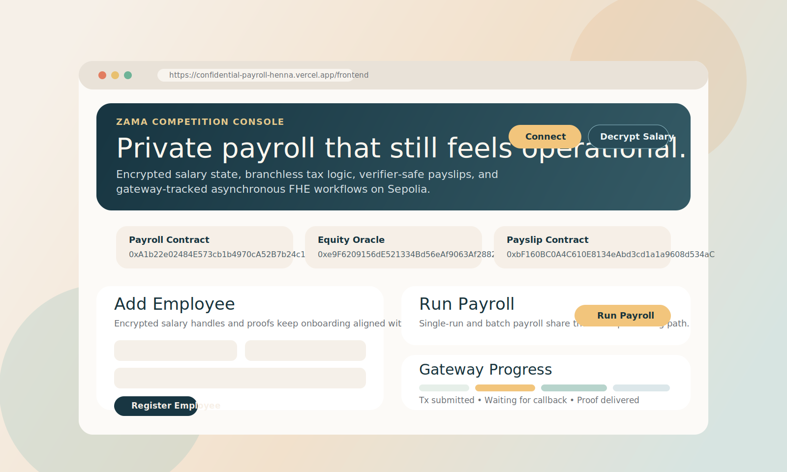

# Confidential Payroll

Confidential Payroll is a Zama fhEVM submission built around a real workplace problem. Salaries, bonuses, deductions, and payroll outputs stay encrypted on-chain, while the rest of the system still behaves like software an operations team could actually use: admins manage roles, treasury teams fund salary liquidity, employees request payslips, and regulators can verify compliance claims without prying into individual compensation.

## Frontend At A Glance

Live frontend: `https://confidential-payroll-henna.vercel.app/frontend`



The current codebase is organized around five folders that matter in practice:

- `contracts/` for the Solidity system.
- `scripts/` for deployment and demo flows.
- `frontend/` for the Vue-based operator console.
- `docs/` for focused walkthroughs.
- `test/` for Hardhat coverage.

## Sepolia Deployment

The repository is aligned to one published Sepolia deployment:

| Contract | Address |
| --- | --- |
| ConfidentialPayroll | `0xA1b22e02484E573cb1b4970cA52B7b24c13D20dF` |
| ConfidentialPayToken | `0x861d347672E3B58Eea899305BDD630EA2A6442a0` |
| ConfidentialEquityOracle | `0xe9F6209156dE521334Bd56eAf9063Af2882216B3` |
| ConfidentialPayslip | `0xbF160BC0A4C610E8134eAbd3cd1a1a9608d534aC` |

The frontend opens with those addresses prefilled so reviewers can use the live deployment immediately.

## What Changed

This final pass focused on making the repo read like a serious submission and not a rough internal workbench:

- Payroll processing now goes through a shared internal helper instead of keeping the `runPayroll()` and `batchRunPayroll()` logic manually in sync.
- Tax brackets are configurable through `setTaxBrackets()` under `ADMIN_ROLE`.
- CPT now has reserve-backed treasury hooks in the payroll contract so admins can fund confidential salary liquidity and process redemption requests against ETH or approved ERC-20 reserves.
- Multi-currency support is explicit: admins set a `baseCurrency` and a plaintext `exchangeRateBps`, and reserve-backed CPT minting uses that rate.
- The oracle now supports aggregate-focused claims, including department-average and gender-pay-gap checks, using encrypted aggregate totals plus shift-based normalization that stays compatible with fhEVM v0.6.
- Role updates emit a dedicated `RoleUpdated` event in addition to OpenZeppelin’s native role events.
- The frontend is consolidated into one polished console in `frontend/index.html`. The duplicate HTML demo is gone.

## Why The Tax Logic Looks Different

The repo keeps its tax path branchless for a simple reason: decrypting inside the tax loop would leak salary information and would not work on the real gateway-backed flow. fhEVM v0.6 also removed the generic encrypted `mul` and `div` route this project originally relied on.

So the implementation uses:

- `TFHE.min()` to cap each bracket.
- `TFHE.select()` to stay branchless.
- `TFHE.shr()` to approximate the supported public tax rates.

That is not just a clever trick for the judges. It is the reason the contract can stay privacy-preserving and still compile against the actual library version used here.

## Quick Start

```bash
npm install
npx hardhat compile
npx hardhat test
```

To preview the frontend locally:

```bash
npm run frontend:serve
```

Then open `http://127.0.0.1:8080`.

## Judge Demo Flow

If you want the shortest credible review path:

1. Open `https://confidential-payroll-henna.vercel.app/frontend`.
2. Confirm the Sepolia contract addresses shown in the UI.
3. Connect a Sepolia wallet.
4. Review the add-employee flow to see how encrypted handles and proofs enter the system.
5. Trigger payroll, an equity certificate request, or a payslip request from an authorized account.
6. Use Etherscan and the UI’s gateway-progress panel to inspect the on-chain flow.

For a tighter reviewer handoff:

- [Judge Path](./docs/JUDGE_PATH.md)
- [Submission Cover Note](./docs/COVER_NOTE.md)
- [60-90 Second Demo Script](./docs/DEMO_VIDEO.md)

## Deployment Notes

This cleanup pass did not redeploy anything.

If you do need to redeploy:

1. Copy `.env.example` to `.env`.
2. Fill in `PRIVATE_KEY` and the Sepolia RPC settings.
3. Run `npm run deploy:zama`.

The deploy script still writes `.env.deployed` and `deployment.json` for the helper scripts and frontend.

## Contract Highlights

### `ConfidentialPayroll.sol`

- Shared `_processEmployeePayroll()` helper for single-run and batch processing.
- `setTaxBrackets()` for configurable brackets with validation.
- `setBaseCurrency()` and `setReserveAsset()` for treasury configuration.
- `depositSalaryTokenReserve()` and `requestSalaryTokenRedemption()` for reserve-backed CPT operations.
- `grantOperationalRole()`, `revokeOperationalRole()`, `grantAdminRole()`, and `revokeAdminRole()` for clearer role workflows.

### `ConfidentialEquityOracle.sol`

- Existing employee-focused claim types remain in place.
- New aggregate claims:
  - `AVERAGE_DEPARTMENT_SALARY`
  - `GENDER_PAY_GAP`
- HR can publish encrypted department and gender aggregate totals plus normalization metadata used by the oracle.

### `ConfidentialPayslip.sol`

- Payslip verification stays verifier-scoped.
- Payroll authorization is now tracked explicitly in contract state.

## Frontend

The frontend is intentionally direct. It is a Vue console for judges and operator review, not a generic dashboard template. It covers:

- employee onboarding
- payroll execution
- equity certificate requests
- payslip requests
- payslip verification
- gateway progress tracking for async FHE flows

The live forms accept encrypted handles and proofs because that matches how the contracts work. In other words, the UI does not pretend plaintext salary input is safe when it is not.

## Security And Analysis

- `npx hardhat test` passes.
- `npm audit` currently reports transitive dependency issues inherited from the older `hardhat`, `fhevm`, and `fhevmjs` stack pinned by this project.
- Slither was installed in a local virtual environment and invoked, but the full Hardhat-based analysis timed out in this environment before returning detector output. The repo now includes a `slither` script so the same check can be rerun in a roomier CI runner.

See [SECURITY.md](./SECURITY.md) for disclosure guidance and the current analysis summary.

## Useful Docs

- [Architecture](./docs/ARCHITECTURE.md)
- [FHE Operations](./docs/FHE_OPERATIONS.md)
- [Payslip Flow](./docs/PAYSLIP.md)
- [Security Policy](./SECURITY.md)
